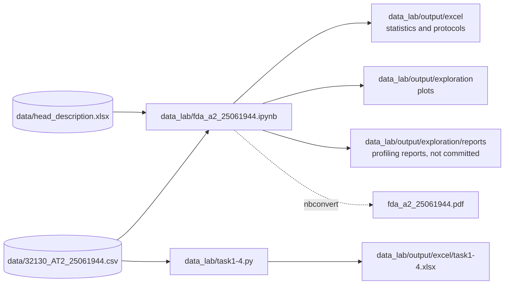

<div align="center">

# Gaia Exploration

**Exploratory data analysis and preprocessing of 3,000 Gaia DR3 stars of the spectral classes A and B**


[Quick start](#quick-start) · [Outputs](#outputs) · [Documentation](#documentation)

</div>

This repository contains the notebook, scripts, results and report of Assessment Task 2 ("Data exploration and
preparation") of the course 32130 Fundamentals of Data Analytics at the University of Technology Sydney (UTS),
Autumn 2024. The task: understand a sample of Gaia observations, describe every attribute, find relationships between
attributes, and preprocess the data (binning, normalisation, discretisation, binarisation) as a basis for a
classification of the spectral class (A or B).

The classifier built on this analysis is in a separate repository,
[gaia-classifier](https://github.com/HuberNicolas/gaia-classifier).

> [!NOTE]
> This is a course project from 2024 and is no longer developed. The dependencies are locked to the versions from
> April 2024 (pandas 2.2.1, scikit-learn 1.4.1, ydata-profiling 4.7.0). The code was cleaned up in 2026 so that it
> runs again; the analysis and its results are unchanged.

## Features

- 📋 Summary statistics for every attribute (location, spread, skewness, kurtosis, outliers, missing values)
- 🕳️ Missing-value analysis per class and imputation
- 🔗 Correlation analysis with heatmaps, scatter, regression and KDE plots
- 🧭 Dimensionality reduction (PCA, UMAP, t-SNE), k-means and hierarchical clustering
- 🧱 Preprocessing: equi-width and equi-depth binning, scaling, discretisation, binarisation
- 📑 Profiling reports with ydata-profiling
- 📄 Final report as PDF ([fda_a2_25061944.pdf](fda_a2_25061944.pdf)) and Excel workbook

## Contents

- [Tech stack](#tech-stack)
- [How it works](#how-it-works)
- [Repository structure](#repository-structure)
- [Quick start](#quick-start)
- [Outputs](#outputs)
- [Data](#data)
- [Development](#development)
- [Documentation](#documentation)
- [Known issues](#known-issues)
- [Acknowledgements](#acknowledgements)
- [License](#license)
- [Author](#author)

## Tech stack

| Area | Technologies |
|---|---|
| Language and notebook |   |
| Data |    |
| Analysis |    |
| Plots |   |
| Environment |  |

## How it works



| Part | File | What it does |
|---|---|---|
| Notebook | [data_lab/fda_a2_25061944.ipynb](data_lab/fda_a2_25061944.ipynb) | The whole analysis: exploration (1A), preprocessing (1B), correlation, dimensionality reduction, clustering and feature importance |
| Task scripts | [data_lab/task1.py](data_lab/task1.py) … [task4.py](data_lab/task4.py) | The four preprocessing tasks of 1B as standalone scripts: binning, scaling, discretisation, binarisation |
| Report | [fda_a2_25061944.pdf](fda_a2_25061944.pdf) | The notebook exported as PDF (102 pages) |

See [docs/notebook.md](docs/notebook.md) for the sections of the notebook and its settings.

## Repository structure

| Path | Content |
|---|---|
| [data/](data) | The Gaia sample and the column descriptions, see [Data](#data) |
| [data_lab/fda_a2_25061944.ipynb](data_lab/fda_a2_25061944.ipynb) | Notebook with the analysis |
| [data_lab/task1.py](data_lab/task1.py) … [task4.py](data_lab/task4.py) | Preprocessing tasks as scripts |
| [data_lab/fda_a2_25061944.xlsx](data_lab/fda_a2_25061944.xlsx) | Submitted Excel workbook, one sheet per task and protocol |
| [data_lab/exploratory-data-anaylsis.md](data_lab/exploratory-data-anaylsis.md) | Checklist of exploration methods |
| [data_lab/output/](data_lab/output) | Results of the notebook and the scripts, see [Outputs](#outputs) |
| [docs/](docs) | Documentation |
| [fda_a2_25061944.pdf](fda_a2_25061944.pdf) | Final report |

## Quick start

Prerequisite: [uv](https://docs.astral.sh/uv/). uv installs Python 3.11 if it is missing.

1. Clone the repository:

   ```bash
   git clone https://github.com/HuberNicolas/gaia-exploration.git
   ```

   ```bash
   cd gaia-exploration
   ```

2. Install the dependencies (the versions from `uv.lock`):

   ```bash
   uv sync
   ```

3. Open the notebook. It reads its files relative to `data_lab/`, so start Jupyter there:

   ```bash
   cd data_lab
   ```

   ```bash
   uv run jupyter notebook fda_a2_25061944.ipynb
   ```

   Or run it from start to end without the browser (took about 11 minutes on a 10-core laptop):

   ```bash
   uv run jupyter nbconvert --to notebook --execute fda_a2_25061944.ipynb --output executed.ipynb
   ```

4. Run a task script (from any directory):

   ```bash
   uv run python data_lab/task1.py
   ```

> [!WARNING]
> Running the notebook empties the folders it writes to (`exploration/statistics/`, `exploration/features/`,
> `exploration/reports/`, `exploration/dimred/pca/`, `exploration/dimred/hclustering/` and `pk/` in `data_lab/output/`)
> and overwrites its other plots and Excel files. Files you added to these folders are deleted. `output/excel/task*.xlsx`
> and the solution workbook are kept.

## Outputs

| Path | Committed | Content |
|---|---|---|
| `data_lab/output/excel/` | yes | Summary statistics, protocols of the cleaning and preprocessing steps, `task1-4.xlsx` from the scripts, and the solution workbook |
| `data_lab/output/exploration/*.png` | yes | Missing values, outliers, binning, correlation and clustering plots |
| `data_lab/output/exploration/statistics/` | yes | One plot per attribute |
| `data_lab/output/exploration/features/` | partly | Heatmaps, pair plots and one scatter plot per highly correlated pair (`corr_above_scatterplot_0.7/`) |
| `data_lab/output/exploration/dimred/` | yes | PCA, UMAP, t-SNE and hierarchical clustering |
| `data_lab/output/exploration/features/corr_above_*_0/`, `jointplots/` | no | Plots for every pair of attributes (about 3,800 files). Created only when `GENERATE_PAIR_PLOTS = True` |
| `data_lab/output/exploration/reports/` | no | ydata-profiling reports as HTML (40 MB and 356 MB) |
| `data_lab/output/pk/` | no | Intermediate DataFrames as pickle files |

> [!TIP]
> To create a plot for every pair of attributes, set `GENERATE_PAIR_PLOTS = True` in the "Constants" section of the
> notebook. This writes about 3,800 files (about 330 MB).

## Data

> [!NOTE]
> The sample comes from the European Space Agency (ESA) mission Gaia, Data Release 3, and was provided by the course.
> Gaia data are licensed under [CC BY-NC 3.0 IGO](https://www.cosmos.esa.int/web/gaia-users/license); the MIT license
> of this repository does not apply to them.

| File | Rows | Content |
|---|---|---|
| `data/32130_AT2_25061944.csv` | 3,000 | Gaia DR3 sample: 28 attributes and the spectral class `SpType-ELS` (1,666 A, 1,334 B) |
| `data/sample.csv` | 99 | First rows of the sample |
| `data/head_description.csv`, `.xlsx` | 30 | Description of every column and the cleaning action taken |

See [docs/dataset.md](docs/dataset.md) for the columns.

## Development

| Task | Command or guide |
|---|---|
| Install dependencies | `uv sync` |
| Run the notebook headless | see [Quick start](#quick-start) |
| Export the notebook as PDF | `uv run jupyter nbconvert fda_a2_25061944.ipynb --to pdf` in `data_lab/` (needs a LaTeX installation; not tested in 2026) |
| Lint | `uv run pylint data_lab/*.py` (rules in [.pylintrc](.pylintrc)) |
| Format | `uv run black data_lab` |

## Documentation

| Guide | Content |
|---|---|
| [docs/notebook.md](docs/notebook.md) | Sections, settings and outputs of the notebook |
| [docs/dataset.md](docs/dataset.md) | Columns of the dataset |
| [docs/troubleshooting.md](docs/troubleshooting.md) | Problems you may run into |

## Known issues

- `task4.py` and the notebook use the first class in the file as the positive class of the binarisation. That is B,
  although the original comment said A. The results were kept as submitted.
- The profiling report of the cleaned data is 356 MB. It is not committed; run the notebook to create it.

## Acknowledgements

This work presents results from the European Space Agency (ESA) space mission Gaia. Gaia data are being processed by
the Gaia Data Processing and Analysis Consortium (DPAC). Funding for the DPAC is provided by national institutions, in
particular the institutions participating in the Gaia MultiLateral Agreement (MLA). The Gaia mission website is
<https://www.cosmos.esa.int/gaia>.

Gaia Collaboration (2023): *Gaia Data Release 3: Summary of the content and survey properties*. Astronomy &
Astrophysics 674, A1. <https://doi.org/10.1051/0004-6361/202243940>

Thanks to the teaching team of 32130 Fundamentals of Data Analytics at UTS for the assignment. The scenario text at
the start of the notebook is taken from the assignment.

## License

The code is licensed under the [MIT License](LICENSE). If you reuse it, please name me as the source, and feel free
to build on it: we all stand on the shoulders of giants, and I learned a lot from others too.

The Gaia data in [data/](data) are not covered by the MIT License; see [Data](#data).

## Author

Nicolas Huber, University of Technology Sydney (UTS), Autumn 2024.
Course: 32130 Fundamentals of Data Analytics, Assessment Task 2.
